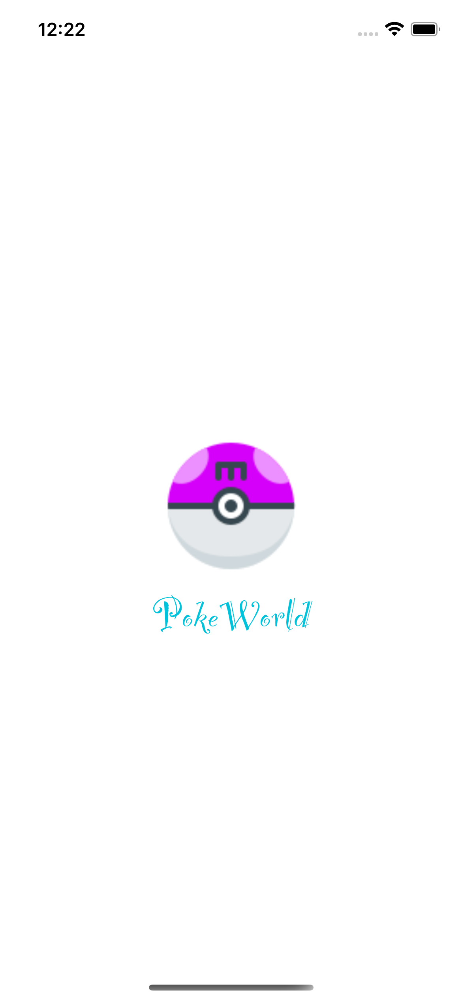
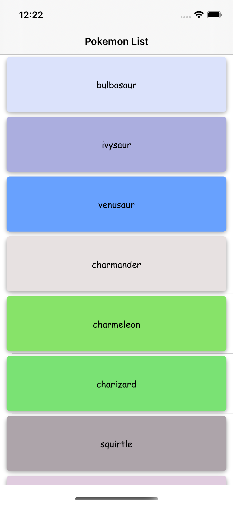
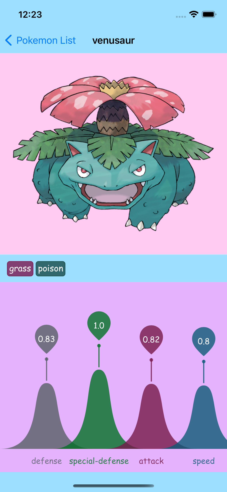

# PokeWorld 
In this application you can have all the pokemon in world. so, go on and search it

# Demo
The goal will be to build an app the shows a list of Pokemon then by clicking on the name you can see some details

## Getting Started 
please clone or download a copy of the project on your system 

### Prerequisites 
you need xcode 11 or higher to run the project 

### Installing 

I used no third party library
No installation is needed just run the app 

## Running the tests 
You can run the test by simply going to `Test Navigator` at *navigation pane* (usually at the left side of the xcode) and run all the tests and see the results. 

## Acknowledgments 
* This app written using ***MVP*** pattern (with seprated networking channel which is connected to presenter) 

* I just covered the `presenter` class for testing. First of all this class is the business logic layer of the application and most important to test; second, due to the nature of the project which is for testing reasons and has no furthure usage and of course limited timing.

